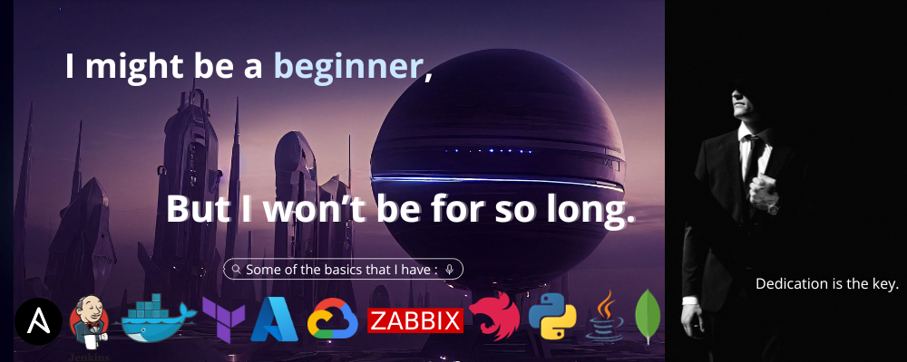

🚀 DevOps & CyberSecurity Student | 🌐 Open Source Enthusiast | 🎓 Computer Science Graduate - Networks and telecommunication engineering degree at [INSAT](https://insat.rnu.tn).

Welcome to my GitHub profile! I'm excited to learn more everyday and discover a lot through serious work & commitment !

## 🛠️ Skills

- **Languages**: Python, Java.
- **Web Development**: HTML, CSS, NestJS.
- **Databases**: MongoDB, MySQL.
- **Tools**: Git, VSCode, Docker, Jenkins, Ansible, Citrix Xenserver, ESXi, Zabbix, LaTeX ...etc
- **Operating Systems**: Linux, Windows.
- **Cloud**: GCP, Azure.
## 🌟 Featured Repositories

- [InternshipMatcher_APIGateway](https://github.com/Mouhib-hero/InternshipMatcher_NESTJS_API_Gateway): API Gateway for a NestJS project "Internship Matcher" based on a microservice architecture with gRPC.
- [Ping Master](https://github.com/Mouhib-hero/PingMaster): A connectivity tester written with Python and a Powershell script that lets you ping IP addresses, monitor their availability, and save the results to a database SQLite.
- [First CI/CD Pipeline](https://github.com/Mouhib-hero/First-pipeline): A simple CI/CD pipeline with Jenkins for a Flask web app that does authentication verification with log to connection attempts.

## 🔗 Contributions

I've had the privilege to contribute to the following repositories:

- [Kerb_VPN](https://github.com/hassen-bouchhiwa/Kerb_VPN):  Implementing a VPN solution with Client/Server encrypted tunnel, using TUN/TAP and Kerberos. My contribution was the setting up of all the Kerberos part with the its existing Python library.
- [CloudiVops](https://github.com/Louaykharouf26/PFA): End of year project. A cloud web platform for configuring and supervising Azure VMs. My contributions included setting up Azure Monitor in the platform and in our Terraform files, as well as assisting through the development of the project.
- [Distributed file sharing system](https://github.com/Souha-LOULOU/Distributed-file-sharing-system): Peer-2-Peer Distributed file sharing system with Gnutella using two approaches; "Java sockets" and "RMI". My contribution was that I developed the first approach.

## 📫 Let's Connect

- LinkedIn: [Mouhib-hero](https://www.linkedin.com/in/benjemaamouhib19/)
- Personal Website: [UniversityStuff]https://mouhib-hero.github.io/univstuff/
- Portfolio: Soon.
<!--[Your Portfolio Website](link-to-portfolio)-->

Feel free to explore my repositories and connect with me. I'm always open to collaboration and new opportunities!
